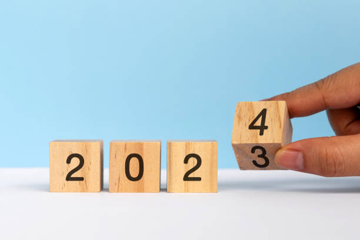

# goals

## Curent 

- [ ] 21k Media Maratón 2024 | Correr la media maratón de valencia

- [ ] Leer libro Influence | Empezado 

- [ ] Leer libro ReiniciaTech | Empezado

- [ ] Aprender paella para 2 | Hacer paella para 2

- [x] Aprender hacer puchero | Aprender a cocinar

- [x] Curso CodelyTV | Curso de SOLID

- [x] Curso CodelyTV | Curso de Arquitectura Hexagonal

- [x] Curso CodelyTV | Curso de DDD

- [x] Backup | Nextcloud RPI

- [x] Backup | FoodApp RPI
  

## Next 

- [ ] Crear proyecto Librería | Angular & API

- [ ] Curso de Extreme Programming | [codelyTv](https://pro.codely.com/library/extreme-programming-171308/386675/path/)

- [ ] Curso de CQRS | [codelytv](https://pro.codely.com/library/cqrs-command-query-responsibility-segregation-29074/62554/path/)

- [ ] Curso de Testing | [codelytv](https://pro.codely.com/library/testing-introduccion-y-buenas-practicas-44653/90916/path/)

- [ ] Leer libro de Código Sostenible

  

## Backlog

- [ ] Crear sistema de Logs |..........|

- [ ] Automatizar tareas de backup |..........|

- [ ]

  

